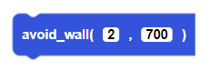
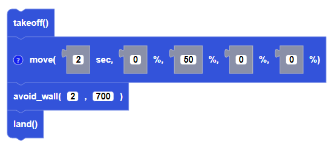

Allows the CoDrone EDU to avoid walls that are a certain distance away (in millimeters) for a specific amount of time (in seconds).

##### Parameters
**timeout**: any positive integer
**distance**: any positive integer

##### Returns

None

##### Example

