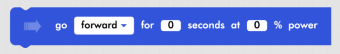
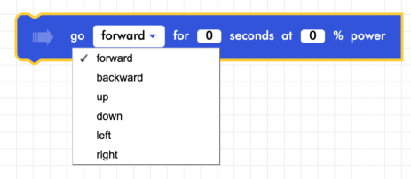
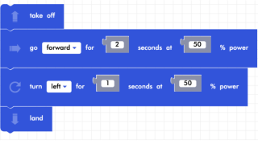

Moves the drone in a direction for a given duration and a percentage power.

##### Parameters

**direction**: forward, backward, up, down, left, right   
**power**: Integer between -100 and 100   
**seconds**: any integer (from -infinity to +inifnity)

##### Returns

None

##### Example

