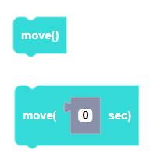
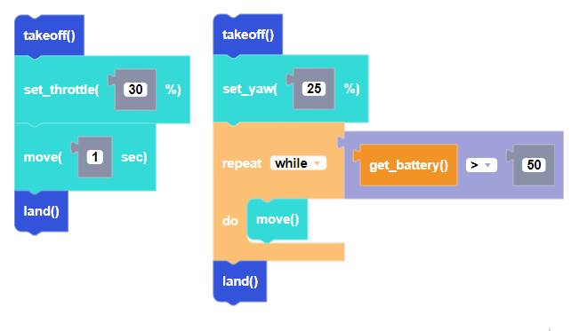

Moves the CoDrone EDU for a specific duration of time after flight variables have been set. Use the version without a paramter to have the CoDrone EDU move indefinitely.

##### Parameters
**seconds**: any integer or decimal value (from -infinity to +inifnity)

##### Returns

None

##### Example

