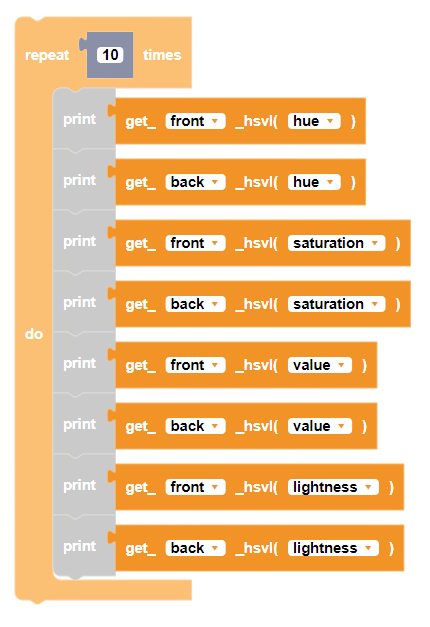

 
Gets the HSVL data from the CoDrone EDU's color sensors.

##### Parameters
 
**type**: front, back  
**unit**: hue, saturation, value, lightness

##### Returns

hsvl value from sensor

##### Example

