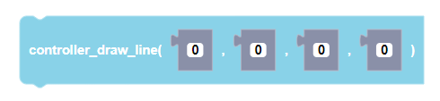
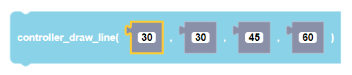
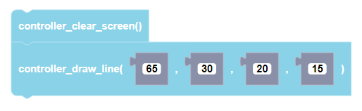

 
Draws a line at a specific location on the CoDrone EDU LED screen.

##### Parameters
  
**x1**: any integer (from 0 to +inifnity)  
**y1**: any integer (from 0 to +inifnity)  
**x2**: any integer (from 0 to +inifnity)  
**y2**: any integer (from 0 to +inifnity)  

##### Returns

None

##### Example

