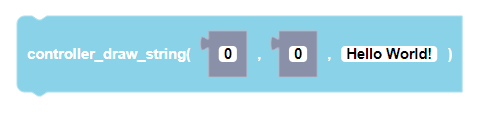
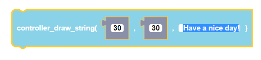
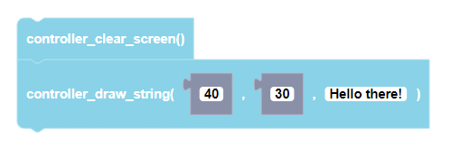

 
Plays a note for a specified amount of time in milliseconds using the CoDrone EDU.

##### Parameters
  
**xStart**: any integer (from 0 to 128)  
**yStart**: any integer (from 0 to 64)  
**text**: any string input

##### Returns

None

##### Example

