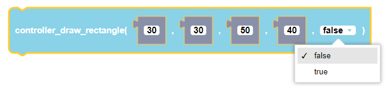
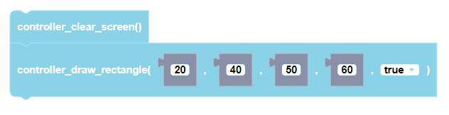

 
Plays a note for a specified amount of time in milliseconds using the CoDrone EDU.

##### Parameters
  
**xStart**: any integer (from 0 to 128)  
**yStart**: any integer (from 0 to 64)  
**width**: any integer (from 0 to 128)  
**height**: any integer (from 0 to 64)  
**flagFill**: true or false

##### Returns

None

##### Example

