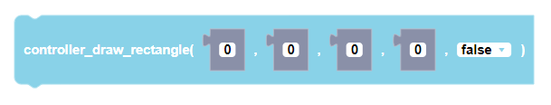

 
Draws a rectangle at a specific location on the CoDrone EDU LED screen.

##### Parameters
  
**xStart**: any integer (from 0 to +inifnity)  
**yStart**: any integer (from 0 to +inifnity)  
**width**: any integer (from 0 to +inifnity)  
**height**: any integer (from 0 to +inifnity)  
**flagFill**: true or false

##### Returns

None

##### Example

