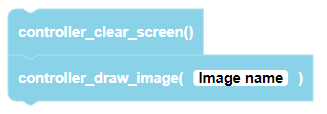
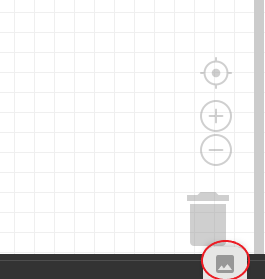
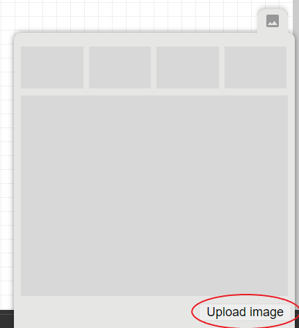
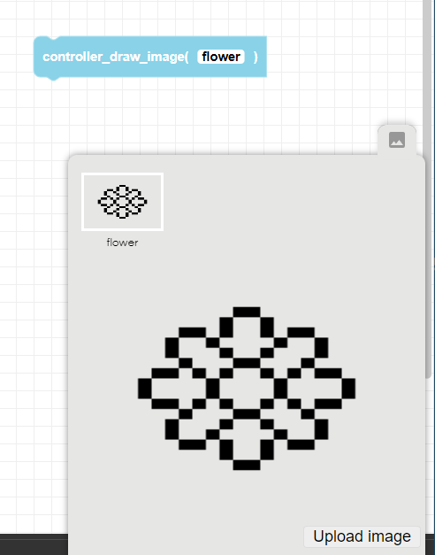
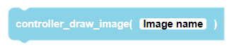

 
Draws an uploaded image to the CoDrone EDU controller's LED screen.

##### Parameters
  
  
  
**Image name**: Image file name. The image file format must be .png, .jpg, or .jpeg  

##### Returns

None

##### Example

