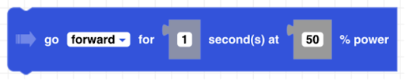
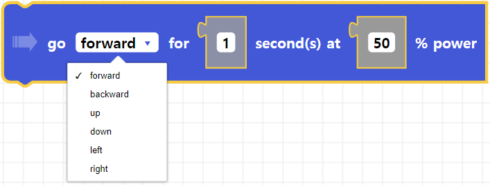
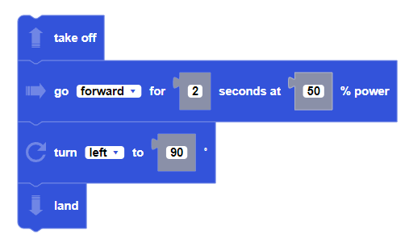

##### Block

##### Description

This function flies the drone in a direction for a given duration and a power percentage.

##### Parameters

**direction**: forward, backward, up, down, left, right   
**duration**: positive integer in seconds 
**power**: positive integer between 0 and 100   

##### Returns

None 

##### Example

