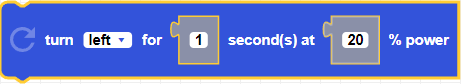

##### Block

##### Description

Turns CoDrone EDU to the left or to the right for a duration in seconds at a percentange of power.

##### Parameters
**direction**: left, right   
**duration**: positive integer in seconds   
**power**: integer between 0 and 100

##### Returns

None

##### Example

