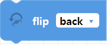
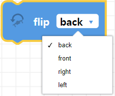
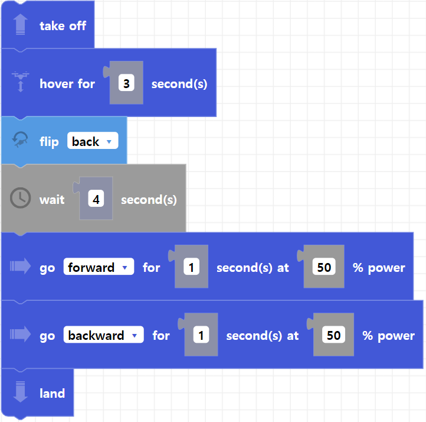

##### Block

  

##### Description

This functions makes the drone flip backward, forward, right, or left. Make sure your battery percentage is over 50% for the flip to execute.

##### Parameters
  
**direction**: back, front, right, left   

##### Returns

None

##### Example
Add a hover or delay block after the flip if you need to stabilize before your next command. The drone takes 3-4 seconds after a flip before it can do another flight command.

