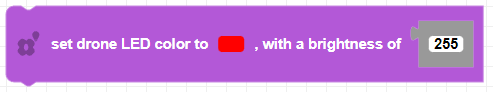

### Block

### Description

Sets the color of the CoDrone EDU's LED.

##### Parameters
 
**color**: red, yellow, green, light blue, blue, purple, white, black  
**brightness**: Integer between 0 and 100   

##### Returns

None

##### Example

