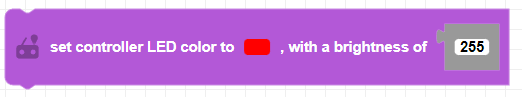

##### Block

##### Description

Sets the color and brightness of the CoDrone EDU controller LED.

##### Parameters               
 
**color**:select a color from the color palette 
**brightness**: positive integer between 0 and 255   

##### Returns

None

##### Example

