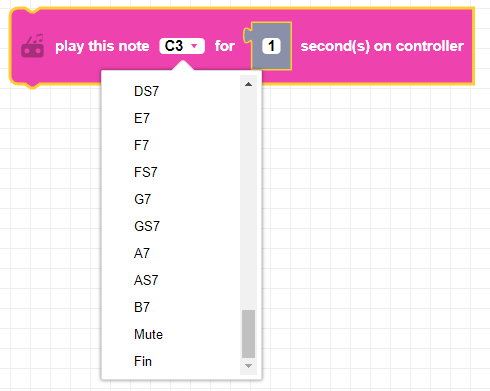
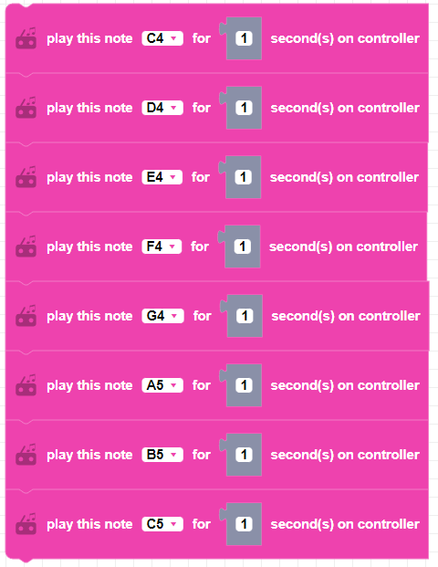

 
Plays a note for a specified amount of time in milliseconds using the CoDrone EDU controller.

##### Parameters
  
**note**: note range from C3 to B7, EndOfType, Mute, Fin  
**duration**: any integer (from 0 to +inifnity)

##### Returns

None

##### Example

