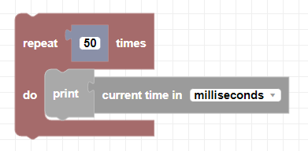

##### Block

##### Description

Returns the current Epoch time. The Epoch time is the amount of time elapsed since January 1, 1970 at midnight.

##### Parameters

None

##### Returns

The current Epoch time in either seconds or milliseconds.

##### Example

