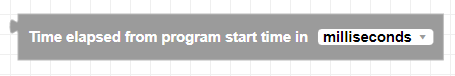
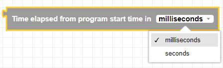
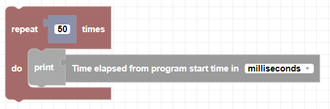

##### Block

##### Description

Returns the amount of time that has elapsed since the program started running.

##### Parameters

None

##### Returns

The amount of time that has elapsed since the program started running in either seconds or milliseconds.

##### Example

