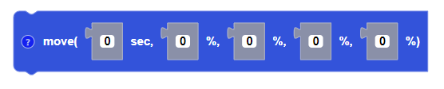

##### Block

##### Description

Moves the drone for a certain amount of time (in seconds) in a given direction determined by the flight parameters. 

##### Parameters

**roll**: roll power percentage as an integer between -100 and +100  
**pitch**: pitch power percentage as an integer between -100 and +100 
**yaw**:yaw power percentage as an integer between -100 and +100  
**throttle**:  throttle power percentage as an integer between -100 and +100 
**duration**: positive integer in seconds  

##### Returns

None

##### Example
In this example, roll and pitch are both set to positive 30% while yaw and throttle remain at 0%. CoDrone EDU will fly forward and to the right (diagonally) for 1 second at 30% speed.

