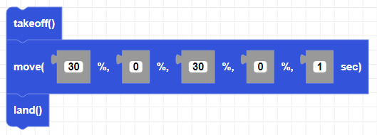

##### Block

##### Description

Moves the drone in a direction for a given duration and given power percentage.

##### Parameters

**roll**: any integer (from -100 to +100)   
**pitch**: any integer (from -100 to +100)  
**yaw**: any integer (from -100 to +100)   
**throttle**: any integer (from -100 to +100)  
**duration**: the duration of the movement. any positive integer in seconds.  

##### Returns

None

##### Example

