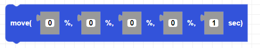

Moves the drone in a direction for a given duration and given power percentage.

##### Parameters

**duration**: any positive integer in seconds
**roll**: any integer (from -100 to +100)
**pitch**: any integer (from -100 to +100)
**yaw**: any integer (from -100 to +100)
**throttle**: any integer (from -100 to +100)

##### Returns

None

##### Example

