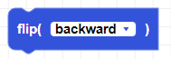
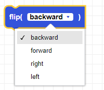
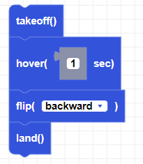

##### Block

##### Description

This functions makes the drone flip backward, forward, right, or left. Make sure your battery percentage is over 50% for the flip to execute.

##### Parameters

**direction**: backward, forward, right, left   

##### Returns

None

##### Example
Add a hover() block before and/or after the flip if you need to stabilize before your next command.

