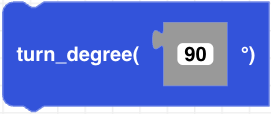

##### Block

##### Description

Turns right or left with absolute reference frame to drone's initial heading. Positive degrees turn to right and negative degrees turn to the left. When the drone pairs after powering on, the current heading will be set as 0 degrees.

##### Parameters
**degrees**: integer from -180 to +180

##### Returns

None

##### Example

