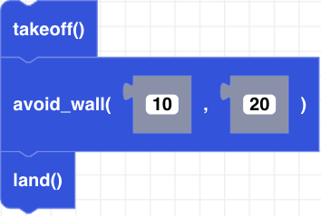

##### Block

##### Description

Allows the CoDrone EDU to avoid walls that are a certain distance away (in millimeters) for a specific amount of time (in seconds).

##### Parameters
**timeout**: timeout is an optional paramaeter that is the duration in seconds that the function will run. the default value is 2  
**distance**: distance is an optional parameter that is the distance in millimeters the drone will stop in front of an object. the default value is 700  

##### Returns

None

##### Example

