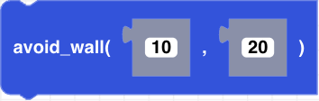

##### Block

##### Description

CoDrone EDU will fly forward and stop when an obstacle is detected a given distance away (in centimeters). The block will run until the timeout (in seconds) is finished or the obstacle is found, whichever comes first. The default timeout is 10 seconds for an obstacle detected 20cm away.
##### Parameters
**timeout**: positive integer timeout duration in seconds  
**distance**: positive integer in centimeters 

##### Returns

None

##### Example
Place the drone on the floor a few feet away from a wall. When you run the code, the drone will fly forward until the wall is detected 30 centimeters away. The next block will immediately execute. In this case, the drone will land.

