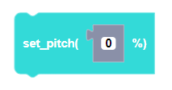
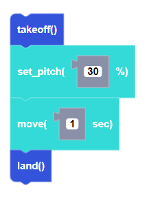

##### Block

##### Description

This function sets the pitch direction variable but will not send a move command. Negative values will move the drone backward and positive values will move the drone forward.

##### Parameters
**power**: integer between -100 and 100   

##### Returns

None

##### Example

