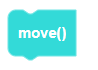
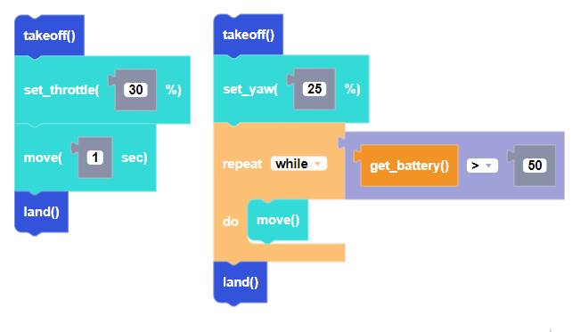

##### Block

##### Description

Moves CoDrone EDU in the direction set by the flight variables with the smallest duration possible (about 0.01 seconds). Since it has no specified duration, it is often used inside of a loop to check sensors simultaneously.

##### Parameters

None

##### Returns

None

##### Example

