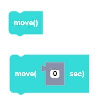

##### Block

##### Description

Moves the CoDrone EDU for a specific duration of time after flight variables have been set. Use the version without a parameter to have the CoDrone EDU move indefinitely. There will be a 0.1 second delay before the move function is executed when using the move function that has no parameters.

##### Parameters
**duration**: any positive integer in seconds

##### Returns

None

##### Example

