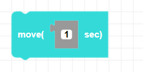
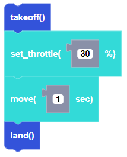

##### Block

##### Description

Moves CoDrone EDU for a duration in seconds in the direction set by the flight variables.

##### Parameters

**duration:** positive integer in seconds

##### Returns

None

##### Example

