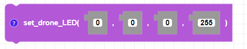

##### Block

##### Description

Sets the color of CoDrone EDU's LED. Colors are set by using its RGB (red, green, blue) equivalent values.

##### Parameters

**red**: positive integer between 0 and 255   
**green**: positive integer between 0 and 255   
**blue**: positive integer between 0 and 255   
**brightness**: positive between 0 and 255   

##### Returns

None

##### Example

