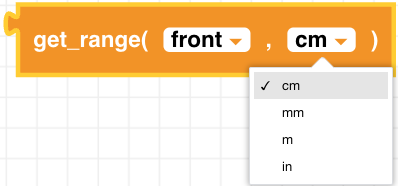

##### Block

 

##### Description

Returns the calculated distance from either the front or bottom infrared (IR) range sensor to the surface. The sensor range is up to 1.5m.

##### Parameters
 
  
**type**: front, bottom 
**unit**: mm, cm, in, m  

##### Returns

**distance**: float value in the units selected

##### Example

