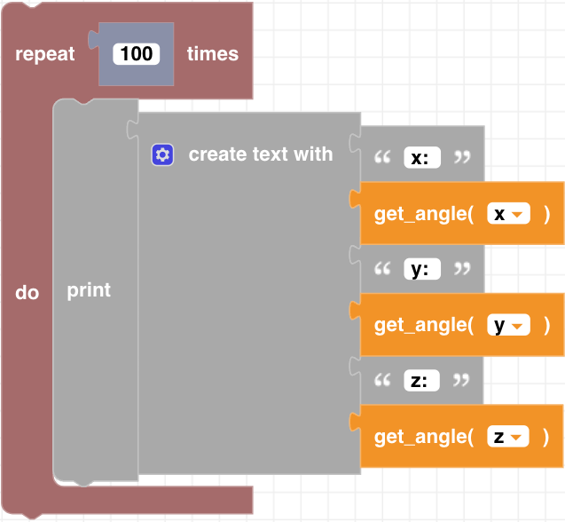

##### Block

 

##### Description

This function returns the current gyroscope angle measurement for either the x (roll),y (pitch),or z (yaw) axis. 

##### Parameters
  
**axis**: x, y, z  

##### Returns

**angle**: integer in degrees

##### Example

