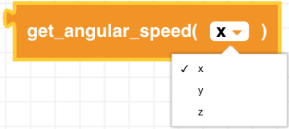
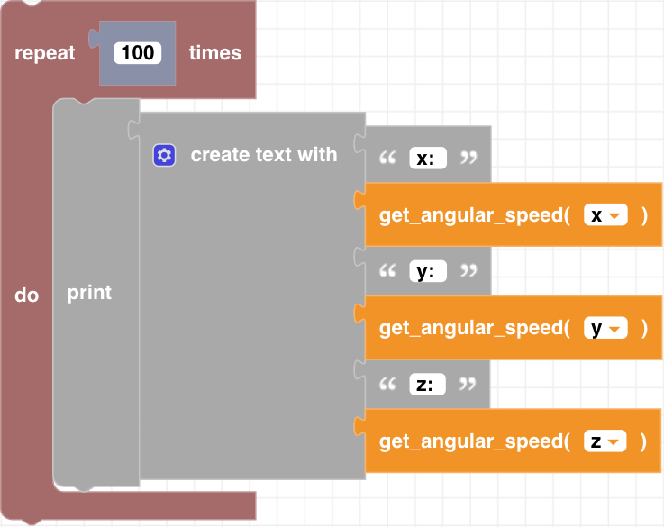

##### Block

 

##### Description

This function returns the current angular velocity in degrees per second for either the x (roll),y (pitch), or z (yaw) axis. 

##### Parameters
  
**type**: x, y, z  

##### Returns

**angular velocity**: integer in degrees per second

##### Example

