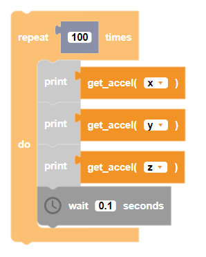

##### Block

 

##### Description

Gets the angular acceleration data from the CoDrone EDU's gyroscope sensor.

##### Parameters
  
**type**: x, y, z  

##### Returns

Acceleration value from sensor

##### Example

