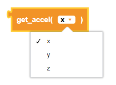
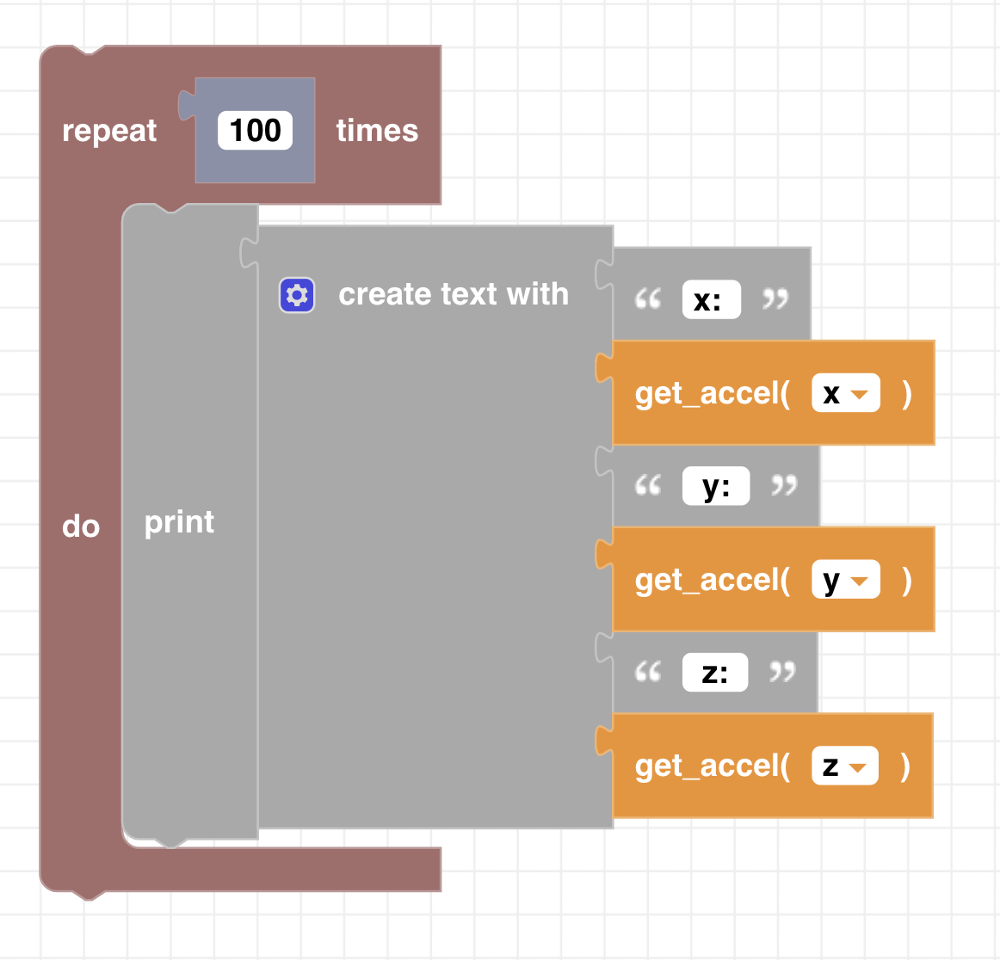

##### Block

 

##### Description

This function returns the current acceleration on either the x, y, or z axis in units of $m/s^ 2 * 10$ .  
**Note:** *1 g* = $9.8m/s^ 2$ 

  

##### Parameters
  
**type**: x, y, z  

##### Returns

**acceleration:** positive or negative integer in $m/s^ 2 * 10$

##### Example

