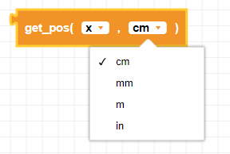

##### Block

 

##### Description

Returns the current estimated position of the CoDrone EDU using the optical flow sensor.  
  
  

##### Parameters

  
**axis**: x, y, z  
**unit**: mm, cm, in, m  

##### Returns

**position:** float x,y, or z value in units selected

##### Example

