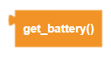
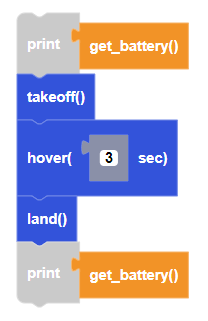

##### Block

 

##### Description

This function returns the current battery percentage of the drone battery.

##### Parameters

None

##### Returns

**battery percentage:** positive integer from 0 to 100

##### Example

