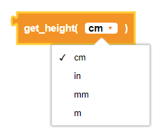
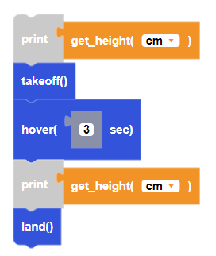

##### Block

 

##### Description

Returns the calculated distance from the bottom infrared (IR) range sensor to the surface. The sensor range is up to 1.5m. This is another name for the get_range("bottom") function.

##### Parameters

**units**: cm, in, mm, m  

##### Returns

**height**: float height value in the units selected

##### Example

