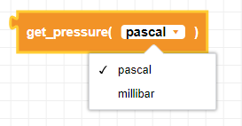
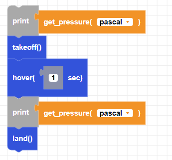

##### Block

 

##### Description

This function returns barometer data in either pascals or millibars.  
**Note:** 1 mbar = 100 Pa

##### Parameters

**unit**: pascal or millibar  

##### Returns

**pressure:** float value in either Pa or mbar
##### Example

