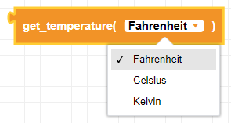
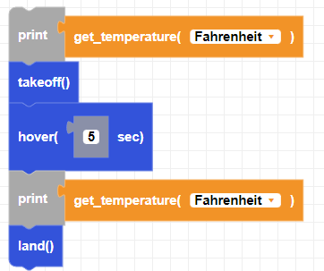

##### Block

 

##### Description

This block returns the current temperature of the drone in either Celsius or Fahrenheit.

##### Parameters

**unit**: Fahrenheit, Celsius, Kelvin  

##### Returns

**temperature:** float value in degrees

##### Example

