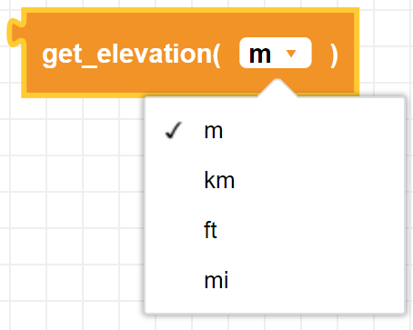
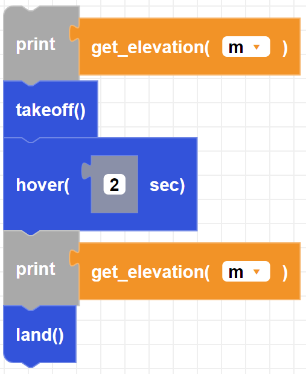

##### Block

##### Description

Gets the elevation data from the CoDrone EDU's barometer sensor.

##### Parameters

**unit**: m (meter), km (kilometer), ft (feet), mi (miles).  

##### Returns

Elevation value from sensor

##### Example

