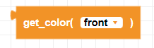
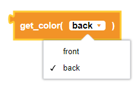
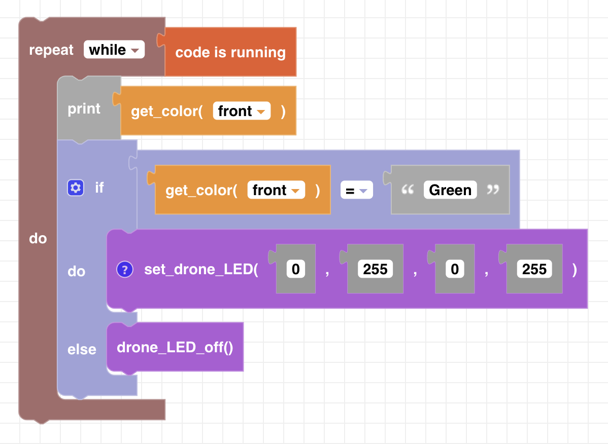

##### Block

 

##### Description

This functions reads the color data from either of the two bottom color sensors and returns one of the 8 pre-calibrated colors (provided in the color cards). The drone must be flat on a surface (not flying) for the color sensor to activate.

##### Parameters

**type**: front, back  

##### Returns

**color:** detected color as a string (Red, Green, Yellow, Blue, Cyan, Magenta, Black, White, Unknown)

##### Example

