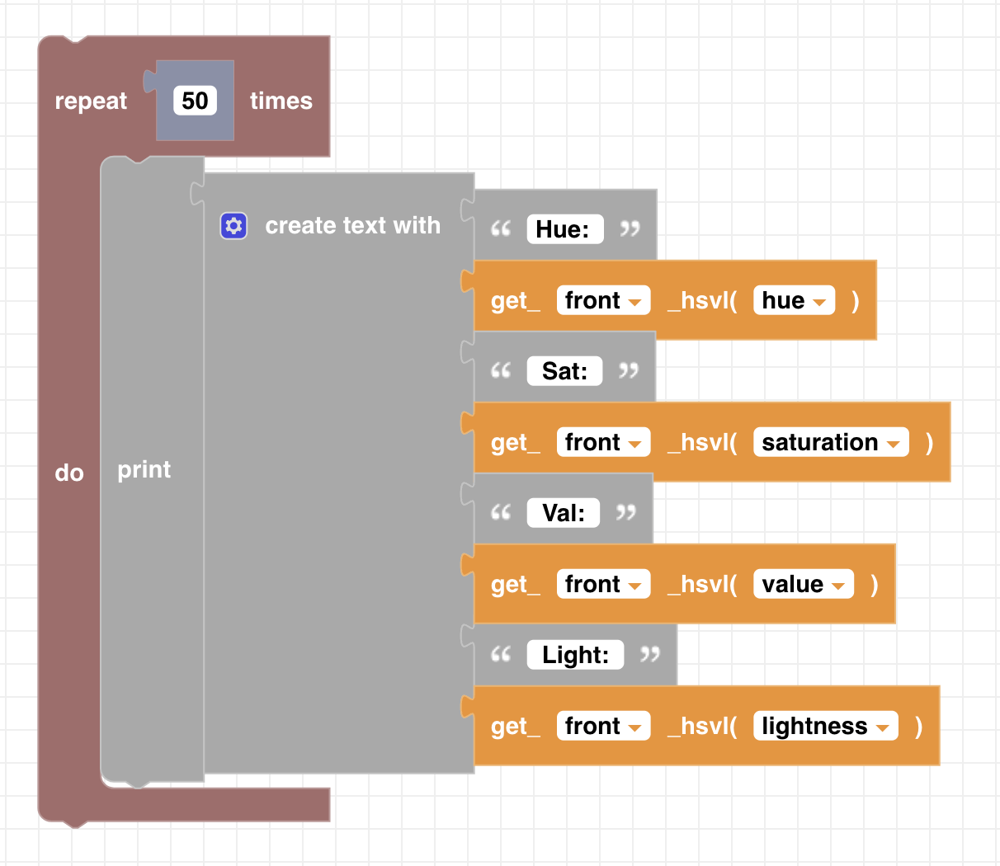

##### Block

 

##### Description

Returns the HSVL (hue, saturation, value, lightness) data from either of the CoDrone EDU's bottom color sensors. The drone must be flat on a surface (not flying) for the color sensor to activate.

##### Parameters

 
**type**: front, back  
**unit**: hue, saturation, value, lightness

##### Returns

hsvl value from sensor

##### Example

