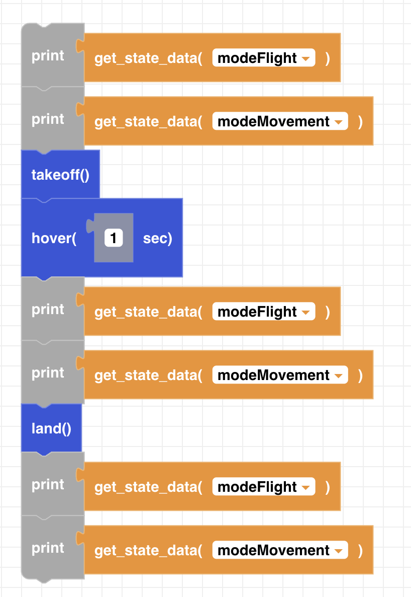

##### Block

 

##### Description

Returns the current state of the CoDrone EDU.

##### Parameters

**unit**: modeFlight, modeMovement  

##### Returns

**state:** name of flight/movement state

##### Example

