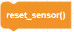
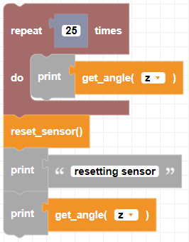

##### Block

 

##### Description

Resets the Gyroscope angles to 0

##### Parameters

None

##### Returns

None

##### Example

To use this example file turn the drone manually with your hand and watch the Z angle change. Once the program completes you will see that the Z angle is reset to 0

