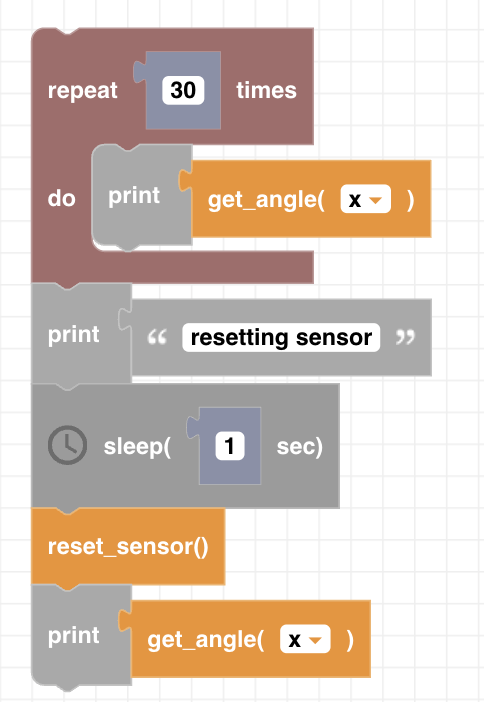

##### Block

 

##### Description

Resets the Gyroscope angles to 0. Make sure the drone is on a flat surface when running this block.

##### Parameters

None

##### Returns

None

##### Example

To use this example file turn the drone manually with your hand and watch the Z angle change. Stop moving the drone during the reset. You will see that the Z angle is reset to 0.

