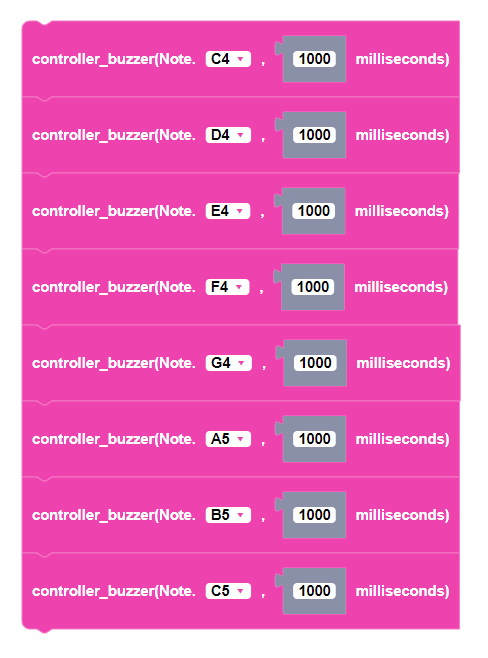

##### Block

 

##### Description

Plays a note for a specified amount of time in milliseconds using the CoDrone EDU controller.

##### Parameters
  
**note**: note range from C3 to B7, EndOfType, Mute, Fin  
**duration**: the duration of the note in milliseconds. any positive integer

##### Returns

None

##### Example

