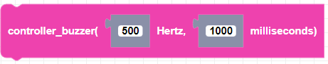
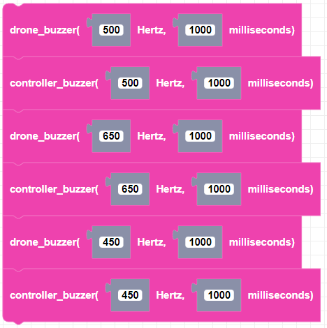

##### Block

##### Description

Plays a sound frequency in Hertz for a specified amount of time in milliseconds using the CoDrone EDU.

##### Parameters

**hertz**: The frequency in Hertz of the sound. Integer value.  
**duration**: the duration of the note in milliseconds. any positive integer

##### Returns

None

##### Example

