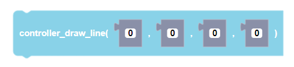
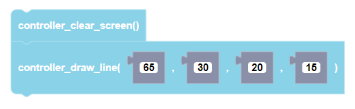

##### Block

<br />

##### Description
```
        (x1,y1) \
                 \
                  \
                   \ (x2,y2)
```
draws a line between points (x1, y1) and (x2, y2)

:::warning

This function is currently unavailable for CoDrone EDU (JROTC ed.).

:::


##### Parameters
 <br />
**x1**: point 1 x coordinate <br />
**y1**: point 1 y coordinate <br />
**x2**: point 2 x coordinate <br />
**y2**: point 2 y coordinate <br />

##### Returns

None

##### Example


