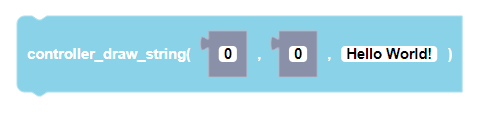
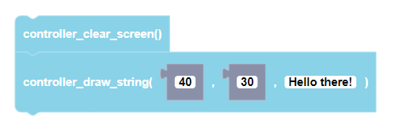

##### Block

 

##### Description

Draws a string from the given x_start, x_end and y positions. The string can be aligned along the x_start and x_end positions    
:::warning

This function is currently unavailable for CoDrone EDU (JROTC ed.).

:::

##### Parameters
  
**xStart**: starting x position  
**yStart**: starting y position  
**text**: any string input

##### Returns

None

##### Example

