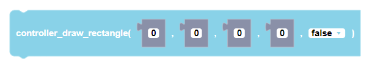
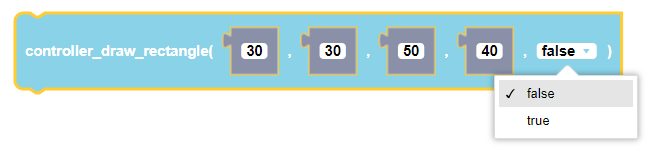
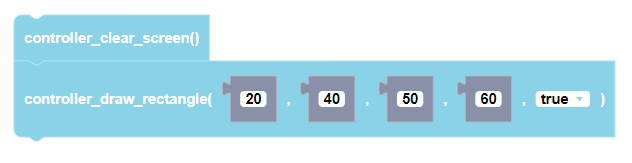

##### Block

 

##### Description

            width
        (x,y)|---------------|
             |               | height
             |_______________|

        draws a rectangle onto the controller screen starting from point (x,y) and extends to given height and width

##### Parameters
  
**xStart**: top left corner x coordinate  
**yStart**: top left corner y coordinate  
**width**: width of rectangle  
**height**: height of rectangle  
**flagFill**: optional parameter to fill in the rectangle or not. default value is False

##### Returns

None

##### Example

